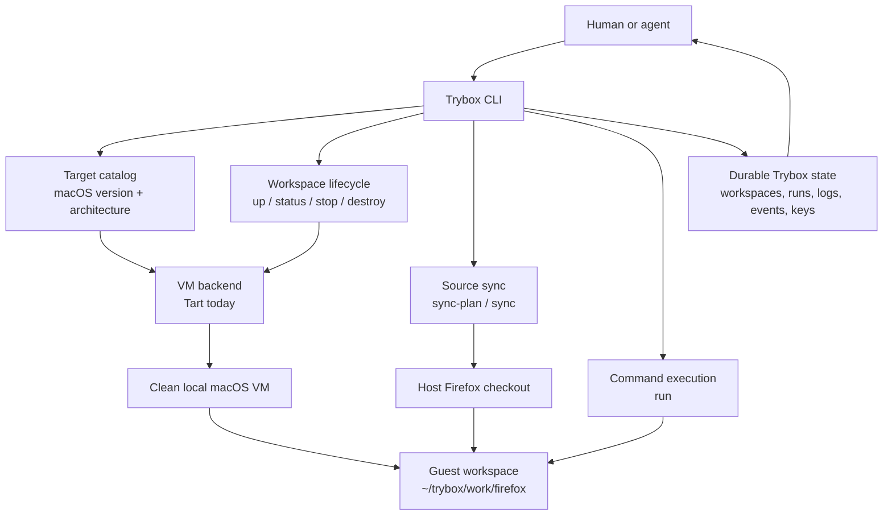

# Trybox Architecture

Trybox is a local execution control plane for clean Firefox development
workspaces. The first backend is Tart, but the product model is not "a Tart
wrapper." The public nouns are:

- **Target**: an OS/architecture shape, such as `macos15-arm64`.
- **Workspace**: a repo-bound local VM for one target.
- **Run**: one command execution with durable logs and metadata.

## Layer Model

Trybox separates three concerns that are often conflated:

1. **Machine isolation**
   Full OS environments, such as Tart macOS VMs or future Windows VMs.

2. **Command isolation**
   Optional process-level sandboxing, such as Bubblewrap or nsjail for Linux.

3. **Workspace isolation**
   Source sync, secret filtering, controlled mounts, and artifact collection.

The macOS MVP uses a Tart VM for machine isolation and does not rely on macOS
process sandboxing as the main boundary.

## Components

```text
trybox CLI
  target registry
  state store
  run coordinator
  sync planner
  backend interface
    tart backend
    future windows backend
    future linux/container backend
  command sandbox interface
    none
    future bwrap/nsjail
  task adapters
    future taskcluster/treeherder/task-debugger import
```

## Current Implementation Diagram



## State

State lives under the user config directory:

```text
~/Library/Application Support/trybox/
  claims/
    claim_*.json
  runs/
    run_*/
      meta.json
      stdout.log
      stderr.log
      events.ndjson
  logs/
    <vm>.log
```

Run logs are intentionally plain files so agents can recover after interruption.

## Backend Interface

The backend surface is intentionally small:

```go
type Backend interface {
    Doctor(...)
    Exists(...)
    IsRunning(...)
    Create(...)
    Start(...)
    Stop(...)
    Destroy(...)
    IP(...)
    Exec(...)
}
```

Tart is currently invoked through `os/exec`. Native Apple
Virtualization.Framework should only be considered if Tart blocks a critical
workflow.

## CI Machine References

Trybox targets are local OS and architecture shapes. They can be informed by the broad
behavior Firefox runs in CI, but they should not expose production pooling
concepts, require production image repositories, run production provisioning, or
require access to CI secrets.

The first implementation expects a Trybox macOS target image with SSH enabled.
Creating that target image is part of the Trybox setup story, not something
the agent-facing `up/sync/run` flow should expose.

See [images.md](images.md) for the source image, target image, and workspace VM
model.

## Large Repository Strategy

The MVP syncs the Git-managed working set into the guest:

```text
host ~/firefox -> guest ~/trybox/work/firefox
```

The intended large-repo sync path is:

1. Keep a seeded clean Firefox checkout inside the VM or attached workspace
   disk.
2. Apply local commits and dirty tracked changes as a patch overlay.
3. Copy nonignored untracked files explicitly.
4. Fall back to manifest-based rsync when patch overlay is not possible.

`trybox sync-plan --json` previews the manifest. `trybox sync --json` performs
the current rsync path and records a fingerprint so unchanged worktrees can
skip repeated transfers.

## Task-Aware Future

Trybox should consume CI task context, not become CI infrastructure.

Future commands:

```sh
trybox task import <task-id-or-treeherder-url>
trybox task plan <task-id>
trybox task run <task-id>
```

The task import layer should extract task label, command, environment,
artifacts, platform hints, and revision. The plan must be visible before
execution because CI payloads are not automatically safe to run locally.

The moved `task-debugger` skill is useful reference material:

```text
https://github.com/ahal/chezmoi/blob/main/dot_claude/skills/task-debugger/SKILL.md
```

It is complementary to Trybox: task-debugger discovers and understands failing
tasks; Trybox provides a clean local execution boundary for native macOS and
future Windows reproduction.
