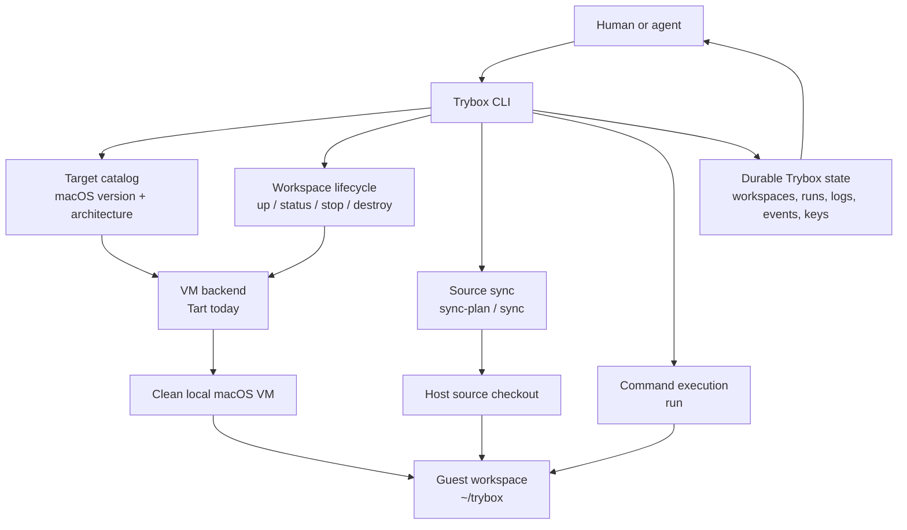

# Trybox Architecture

Trybox is a local execution control plane for clean Mozilla product development
workspaces. The first backend is Tart, but the product model is not "a Tart
wrapper." The public nouns are:

- **Target**: an OS/architecture shape, such as `macos15-arm64`.
- **Workspace**: a repo-bound local VM for one target.
- **Run**: one command execution with durable logs and metadata.

## Layer Model

Trybox separates three concerns that are often conflated:

1. **Machine isolation**
   Full OS environments, such as Tart macOS VMs or future Windows VMs.

2. **Command isolation**
   Optional process-level sandboxing, such as Bubblewrap or nsjail for Linux.

3. **Workspace isolation**
   Source sync, secret filtering, controlled mounts, and artifact collection.

The macOS MVP uses a Tart VM for machine isolation and does not rely on macOS
process sandboxing as the main boundary.

## Components

```text
trybox CLI
  target registry
  state store
  run coordinator
  sync planner
  backend interface
    tart backend
    future windows backend
    future linux/container backend
  command sandbox interface
    none
    future bwrap/nsjail
```

## Current Implementation Diagram



## State

State lives under `~/.trybox`:

```text
~/.trybox/
  workspaces/
    workspace_*.json
  runs/
    run_*/
      meta.json
      stdout.log
      stderr.log
      events.ndjson
  logs/
    <vm>.log
  keys/
    workspace_*/
      id_ed25519
```

Run logs are intentionally plain files so agents can recover after interruption.

## Backend Interface

The backend surface is intentionally small:

```go
type Backend interface {
    Doctor(...)
    Exists(...)
    IsRunning(...)
    Create(...)
    Start(...)
    Stop(...)
    Destroy(...)
    IP(...)
    Exec(...)
}
```

Tart is currently invoked through `os/exec`. Native Apple
Virtualization.Framework should only be considered if Tart blocks a critical
workflow.

## Target References

Trybox targets are local OS and architecture shapes. They can be chosen to
match the Mozilla product behavior a developer needs to reproduce, but the
normal workflow should stay target/workspace/run based instead of exposing
backend image details.

The first implementation expects a Trybox macOS target image with SSH enabled.
Creating that target image is part of the Trybox setup story, not something
the agent-facing `up/sync/run` flow should expose.

See [images.md](images.md) for the source image, target image, and workspace VM
model.

## Large Repository Strategy

The MVP syncs the Git-managed working set and repository metadata into the
guest:

```text
host <mozilla source checkout> -> guest ~/trybox
```

The intended large-repo sync path is intentionally simple:

1. Copy tracked files, nonignored untracked files, and VCS metadata into the
   guest with native `rsync`.
2. Keep `~/trybox` as a real checkout so repo-local tools can inspect Git or
   Mercurial state.
3. Warn on very large transfers instead of inventing a more complex source
   overlay too early.

`trybox sync-plan --json` previews the manifest. `trybox sync --json` performs
the current rsync path and records a fingerprint so unchanged worktrees can
skip repeated transfers.
