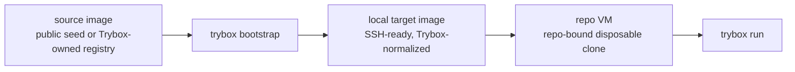

# Trybox Image Model

Trybox should own the image path eventually. Public Tart images are useful as a
bootstrap seed, but they are not enough as the long-term foundation for
repeatable source debugging.

## Terms

- **Source image**: an immutable image used to create a Trybox target image.
  Early development can use a public Tart image. Long term, this should come
  from a Trybox-owned registry and be pinned by digest.
- **Target image**: the local golden VM image for a Trybox target, such as
  `macos15-arm64`. `trybox run` clones this image into a repo VM when needed.
- **Repo VM**: a disposable, repo-bound clone used by `trybox run`,
  `trybox view`, `trybox status`, and `trybox destroy`.



## Why Own Source Images

Relying on a public `latest` image is acceptable for an early prototype, but it
creates avoidable debugging noise:

- `latest` can drift under the same name.
- SSH, Rosetta, Xcode command line tools, system settings, and update state can
  change outside Trybox.
- A public registry can disappear, rate-limit, or publish a breaking change.
- Agents need a stable contract so a failing local repro can be repeated later.
- Security review is cleaner when the source image, bootstrap recipe, and digest
  are recorded together.

## Bootstrap Contract

`trybox bootstrap` should become the first-time setup command:

```sh
trybox bootstrap --target macos15-arm64
```

The command should:

1. Check host support and required tools.
2. Resolve the target's source image.
3. Create or refresh the local target image.
4. Start the target image and verify SSH.
5. Install Trybox's local SSH key.
6. Create the guest work directory.
7. Enable desktop auto-login for the Trybox guest user so `trybox view` opens
   directly into a usable desktop.
8. Record image metadata for `doctor`, `run`, and agents.

It should keep Tart details out of the normal `run` workflow.

## Phases

Phase 0:

- Use Packer and Tart to create a local Trybox target image from an IPSW.
- Run shell provision scripts while the image contents are still changing.
- Verify SSH, the Tart guest agent, and basic guest readiness.

Phase 1:

- Publish Trybox-owned source images to a private registry.
- Pin source images by digest.
- Store image metadata under Trybox state.
- Teach `doctor` to report the expected source digest and local target image
  status.

Phase 2:

- Add a repeatable image build recipe.
- Add `trybox image build`, `trybox image publish`, and `trybox image inspect`.
- Extend the same model to Windows targets.

## Public Tart Seed Reference

Tart's official quick start documents public macOS images, including
`ghcr.io/cirruslabs/macos-sequoia-base:latest`, and lists the default
`admin/admin` credentials for GUI, console, and SSH access:

```text
https://tart.run/quick-start/
```

Those images are useful as a fallback and comparison point, but the local
scratch recipe should not depend on cloning them.

## Tart macOS Seed Coverage

Trybox's built-in macOS target catalog should track the macOS families that Tart
publishes public base images for:

| Trybox targets | Tart seed image |
| --- | --- |
| `macos12-arm64`, `macos12-x64-rosetta` | `ghcr.io/cirruslabs/macos-monterey-base:latest` |
| `macos13-arm64`, `macos13-x64-rosetta` | `ghcr.io/cirruslabs/macos-ventura-base:latest` |
| `macos14-arm64`, `macos14-x64-rosetta` | `ghcr.io/cirruslabs/macos-sonoma-base:latest` |
| `macos15-arm64`, `macos15-x64-rosetta` | `ghcr.io/cirruslabs/macos-sequoia-base:latest` |
| `macos26-arm64`, `macos26-x64-rosetta` | `ghcr.io/cirruslabs/macos-tahoe-base:latest` |

Those seed names are an implementation aid for bootstrap. The normal agent
workflow should still use Trybox targets, not Tart image names.

## Quick Local Packer Build

Before `trybox bootstrap` exists, build the default local target image with:

```sh
ci/build-local-macos-image.sh --replace
```

The script runs `packer init`, `packer validate`, and `packer build` against
`ci/macos/packer/trybox.pkr.hcl`. The template creates a fresh Tart VM from a
macOS restore image with `from_ipsw`, drives Setup Assistant with a boot command,
runs the scripts in `ci/macos/provision.d`, stops the VM, and the wrapper
renames a successful temporary VM to Trybox's local target image name, such as
`trybox-macos15-arm64-image`.

Use it with an explicit IPSW path or URL when the target default is not the
macOS build you want:

```sh
ci/build-local-macos-image.sh --ipsw /path/to/UniversalMac_15.x_Restore.ipsw --replace
```

The provision scripts intentionally mirror the useful parts of Cirrus Labs'
Packer template: shell profile setup, high file descriptor limits, Spotlight
disablement, Homebrew build dependencies, Rosetta, GitHub known hosts, Xcode
first-launch handling when Xcode exists, TCC grants for UI automation, and the
Tart guest agent.

After the image exists locally, try it from a Firefox checkout:

```sh
TRYBOX_TARGET=macos15-arm64 trybox run -- ./mach --version
```
